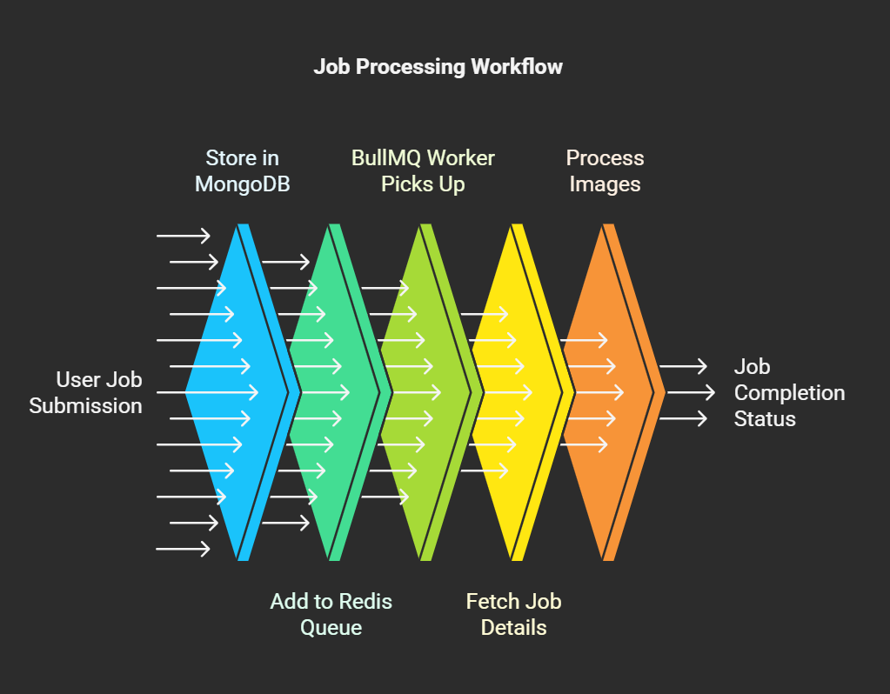

# 🚀 Job Processing API with BullMQ, Redis & MongoDB

## 📌 Project Description

This project is a job processing system using **BullMQ**, **Redis**, and **MongoDB**. It allows users to submit jobs containing images, process them asynchronously, and retrieve job statuses. The system efficiently processes image metadata and calculates the perimeter using **Sharp**.

## ⚡ Features

- Asynchronous job processing with **BullMQ** & **Redis**.
- MongoDB for job persistence.
- Image processing using **Sharp**.
- Job status tracking with real-time updates.

---

## 🛠️ Tech Stack

- **Node.js**
- **Express.js**
- **MongoDB (Mongoose)**
- **Redis (BullMQ)**
- **Axios** (For fetching images)
- **Sharp** (For image processing)

---

## 🌎 GitHUB URL

 - 

---

## 📦 Installation & Setup

### 1️⃣ Prerequisites

- [Node.js](https://nodejs.org/)
- [MongoDB](https://www.mongodb.com/)
- [Redis](https://redis.io/) (Get Redis URL from [Redis Cloud](https://redis.com/cloud/))

### 2️⃣ Clone the Repository

```sh
 git clone https://github.com/your-username/job-processor.git
 cd job-processor
```

### 3️⃣ Install Dependencies

```sh
 npm install
```

### 4️⃣ Configure Environment Variables

Create a `.env` file in the root directory and add:

```env
PORT=5000
MONGO_DB_URI=mongodb+srv://<your-mongo-connection>
REDIS_URL=redis://default:<password>@<hostname>:<port>
```

### 5️⃣ Start Services

#### Without Docker (Manually Start MongoDB & Redis)

```sh
 npm run dev  # Runs the API
```
---

## Live link of Backend

- [Hosted on render](https://image-processing-bck.onrender.com)

## 🔥 API Endpoints

### 1️⃣ **Submit a Job**

```http
POST /api/jobs/submit
```

**Request Body:**

```json
{
  "count": 2,
  "visits": [
    {
      "store_id": "123",
      "image_url": ["https://example.com/image1.jpg"]
    }
  ]
}
```

**Response:**

```json
{
  "job_id": "60f7e7b2e4b0a4bcd0211d4b"
}
```

### 2️⃣ **Get Job Status**

```http
GET /api/jobs/status?jobid=60f7e7b2e4b0a4bcd0211d4b
```

**Response:**

```json
{
  "status": "completed",
  "job_id": "60f7e7b2e4b0a4bcd0211d4b"
}
```

---

## 🏗️ Folder Structure

```
📂 job-processor
│── 📂 config            # Configuration files (Redis, MongoDB)
│── 📂 models            # Mongoose models
│── 📂 routes            # Express routes
│── 📂 worker            # BullMQ worker logic
│── 📂 controller        # controllers
│── 📂 utils             # utils
│── 📂 asset             # asset
│── app.js              # Express API entry point
│── .env                # Environment variables
│── package.json        # Dependencies
│── README.md           # Documentation
│── .gitignore          # gitignore
```

---

## 🛠️ Work Environment

- **OS**: Windows 11 / Ubuntu 22.04
- **IDE**: VS Code
- **Node.js Version**: 18+
- **MongoDB Atlas (Cloud Database)**
- **Redis Cloud (Cloud Caching & Queues)**

---

## 📊 Workflow Diagram

Below is a visual representation of the job processing workflow:



---

## 🔮 Assumptions & Future Modifications

### Assumptions
- The images submitted via jobs are valid URLs and accessible.
- Redis and MongoDB connections are stable, and failures are handled gracefully.
- Each job is independent and does not require dependencies between multiple jobs.
- Job execution times are reasonable and do not exceed Redis TTL (if set).

### Future Modifications
- ✅ **WebSocket Integration**: Implement WebSockets for real-time job status updates.
- ✅ **Rate Limiting**: Introduce rate limiting to prevent abuse of API endpoints.
- ✅ **Worker Thread Optimization**: Enhance performance by using worker threads for image processing.
- ✅ **Authentication & Authorization**: Secure API endpoints by adding authentication (JWT or API Keys).
- ✅ **Queue Prioritization**: Implement job prioritization to handle urgent jobs first.
- ✅ **Docker Support**: Containerize the application with Docker for easy deployment.
- ✅ **UI Dashboard**: Build a simple frontend dashboard to monitor job processing statuses.

---

## 🤝 Contribution

Feel free to submit pull requests or raise issues to improve the project! 🚀

---

## 📜 License

MIT License © 2024 Arnav Goutam

